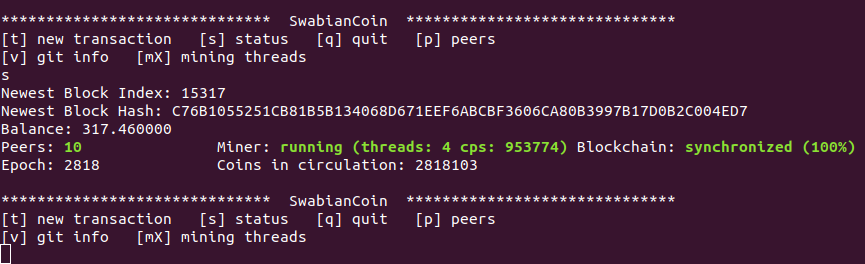

&nbsp;&nbsp;&nbsp;&nbsp;&nbsp;&nbsp;&nbsp;&nbsp;&nbsp;&nbsp;&nbsp;&nbsp;&nbsp;&nbsp;&nbsp;&nbsp;[](https://www.gnu.org/licenses/gpl-3.0)

## Table of Contents

 - [Key Features](#key-features)
 - [Links](#links)
 - [Usage](#usage)
 - [Technical Documentation](#technical-documentation)
 - [Compiling from source](#compiling-from-source)

## Key Features

SwabianCoin (SCN) is yet another cryptocurrency with the following key features:

 - **Separation between mining and block creation**: 
   In contrast to many other cryptocurrencies, in SwabianCoin there is a strict separation between mining and block creation. 
   The idea is inspired by raw materials like gold, where it takes more and more effort to mine the raw material but it takes little effort to trade with the raw material.
   Thus, the computational effort to find (~mine) new SwabianCoins gets higher and higher. However, transferring SwabianCoins between participants and creating new blocks in the blockchain is done using a simple and computationally easy consensus strategy.

 - **Fast**: 
   A new block in the blockchain is negotiated every two minutes between all participants of the peer 2 peer network.
   This means, that a transaction is integrated into the blockchain within two minutes.

 - **Secure**: 
   SwabianCoin uses the FIPS 140 validated, proven-in-use cryptography library OpenSSL. 

 - **Privacy**: 
   A baseline mechanism in the blockchain guarantees that transactions older than one day are not traceable in the blockchain.

The name SwabianCoin is a devoted tribute to the home country of the creators of SwabianCoin, a wonderful region with great people both known for their thrift and their inventive spirit. These characteristics hopefully found their way into SwabianCoin. 

## Links

 - GitHub: [https://github.com/SwabianCoin/SwabianCoin](https://github.com/SwabianCoin/SwabianCoin)
 - Web: [https://www.swabiancoin.com](https://www.swabiancoin.com)
 - Mail: <swabiancoin@gmail.com>

## Usage

### Wallet generation

Your personal wallet is a private key which is generated like this:
```
openssl ecparam -name secp256k1 -genkey -noout -out private-key.pem
```

The public key is extracted like this:
```
openssl ec -in private-key.pem -pubout -out public-key.pem
```

### Starting a node
```
./full_node_cli public-key.pem private-key.pem NUM_MINING_THREADS PORT
``` 
 - Replace NUM_MINING_THREADS with the number of threads you want to use for mining (default: 1). 
 - Replace PORT with the listen port you want to use (default: 13286). 
 
Note: Although not necessary, it is generally a good idea to open this port or activate UPnP in your router settings to allow incoming connections.  

### Operate



After starting the executable, check the status by typing 's' + Enter. Make sure that you are connected to some other peers (the maximum number of peers is 10 by default). If not, make sure that your firewall/router settings are not blocking bittorrent communication.

The blockchain state will start "synchronizing" immediately after startup and switch to "synchronized" after some time (usually a few minutes, depending on your connection). 

Congratulations, now your local blockchain is sync with the peer to peer network. The mining will start immediately and show up the hash rate in the status message.

To issue a new transaction, simply type 't' + Enter. Specify the public key file path of the receiver and the amount of SwabianCoins to transfer to integrate a new transaction in the blockchain. It will take up to 2 minutes until the transaction is integrated in the blockchain and the balances are updated.

## Technical Documentation

See [doc/Documentation.md](doc/Documentation.md)

## Compiling from source

See [doc/Build.md](doc/Build.md)

